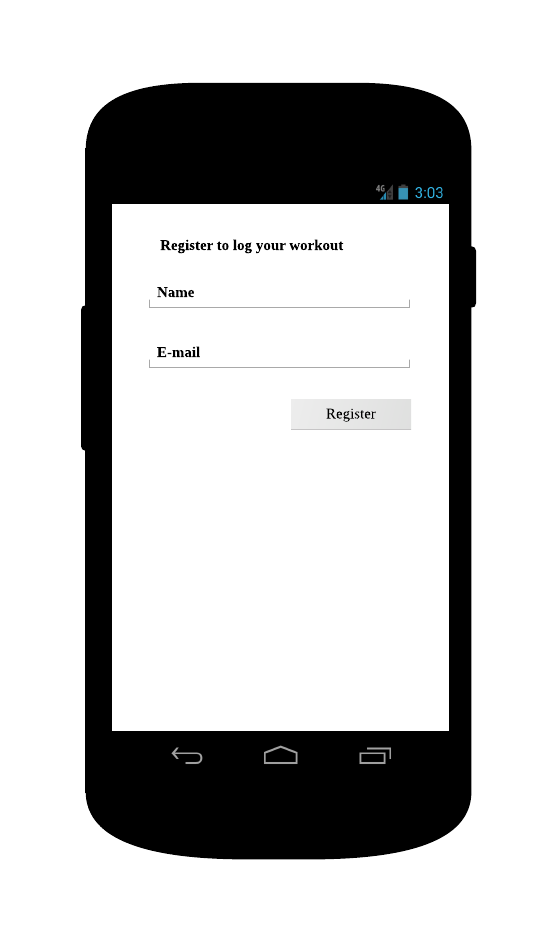
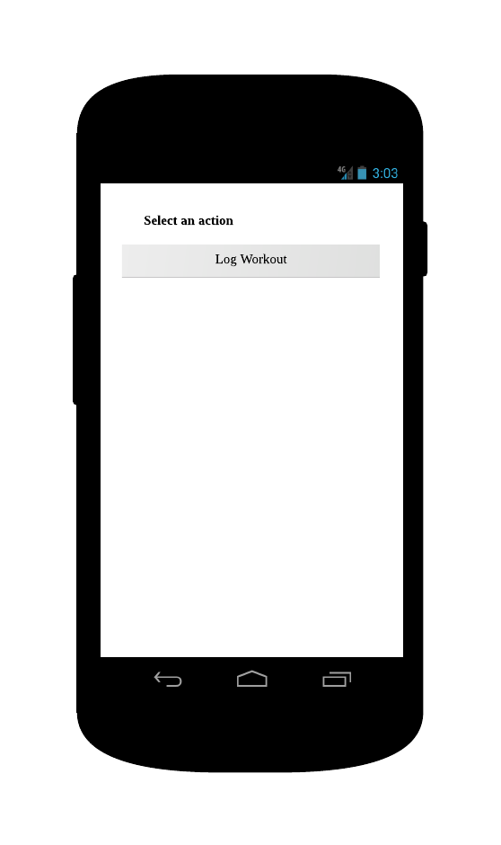
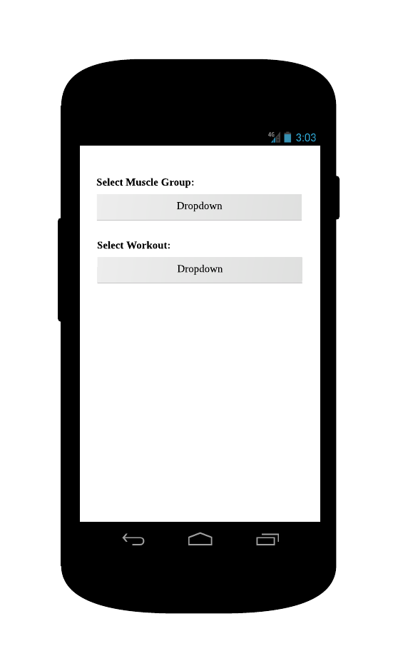
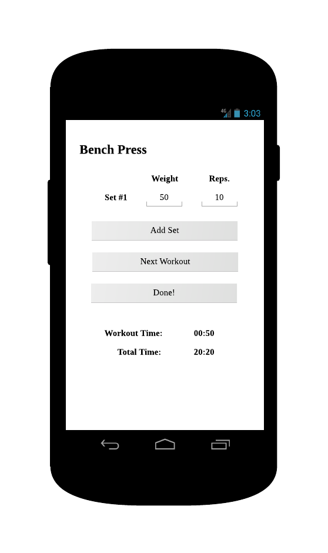

# Mockups
The following mockups and the related description represent the functional requirements of the Fiziq app.

## Sign Up
The very first time a user starts the app, he/she must sign up in order to relate all the logged data
to him/her. The **Sign Up** view is the first that a user encounters. The sign up process is very simple;
the user must provide his/her name and an e-mail address. By tabbing the `Register` button and after a
successful registration (sign up) the user will be taken to the [Home](#home) view. The following mockup
illusrates how the **Sign Up** view can look.

## Home
The **Home** view is where the user can choose various actions, e.g. *Log Workout*. The following mockup
illustrates how the **Home** view can look.

## Workout Selection
When the user wants to log workout (the *Log Workout* action in the [Home](#home) view), he/she is first
taken to the **Workout Selection** view, where it is possible to select a muscle group and a workout that
targets that muscle group. From the **Workout Selection** view the user can go to the [Home](#home) view.
The following mockup illustrates how the **Workout Selection** view can look.

## Log Workout
The **Log Workout** view is used by the user to enter the *weight* and repetitions (*reps.*) for each set
of the workout he/she has selected in the [Workout Selection](#workout-selection) view. Initially, this
view must contain the possibilty for entering weight and reps for one set. There must be a button, 
`Add Set`, that adds a set to the workout. If there exists a record for the workout that is being logged,
the weights and reps of that record must be presented together with each new corresponding set.

There must also be a `Next Workout` button that takes the user to the 
[Workout Selection](#workout-selection) view.

There must also be a `Done!` button that finishes the whole workout session and takes the user to the
[Home](#home) view.

The **Log Workout** view must also display the time spent on the workout at hand and the whole workout
session. 

The following mockup illustrates how the **Log Workout** view can look.

